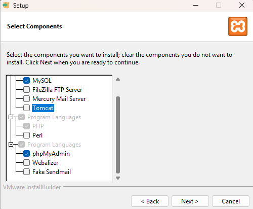

#  Post-It

Post-It is a small website created first as a project and then developed for fun.

It is a website on which you (ideally a community) can write post-its and view them
on the bullettin board of the view page.

## Contents

- [Setup](#setup);
- [Run the Application](#run-the-application);
- [Development Environment](#development-environment);
- [Contributing](#contributing);
- [License](#license).

## Setup

> If you know how to host a website, skip this section.

This section follows what I have done to setup and self-host this website.

### Download XAMPP

Download the latest version of [XAMPP](https://www.apachefriends.org/it/index.html) and install it.
The minimum installation requirements:



### Setup Directory

Download the repo. It is easier if the path to the folder is easily reacheable
as it will be needed to configure the virtual host.

> For example on Windows: `C:\sites\post-it`

### Config Hosts

If the default ports are enough for you there is no need to change them.

> To change the ports on which the apache server listens you can modify httpd.conf

To setup virtual hosts navigate to `C:\xampp\apache\conf\extra\httpd-vhosts.conf` and write the following:

```
<VirtualHost *:80>
  DocumentRoot C:/xampp/htdocs/
  ServerName localhost
</VirtualHost>

<VirtualHost *:80>

    ServerName postit.localhost
    DocumentRoot "C:/sites/post-it"

    <Directory "C:/sites/post-it">
        Options Indexes FollowSymLinks
        AllowOverride All
        Require all granted
        Allow from all
    </Directory>

</VirtualHost>
```

> Paths are written UNIX style and work on Windows in the same way.

Eventually read [this post](https://stackoverflow.com/questions/3660066/hosting-multiple-local-sites-with-xampp) on overflow.

## Run the Application

To run the application:

1. Open XAMPP;
2. Start the Apache server;
3. Start the MySql server;
4. Open the web page at postit.localhost.


## Development Environment

To develop this website I used XAMPP that uses:

- PHP 8.2.12, 8.1.25 or 8.0.30
- Apache 2.4.58
- MariaDB 10.4.32
- phpMyAdmin 5.2.1

## Contributing

View [contributing](./CONTRIBUTING.md)

## License

View [license](./LICENSE.md)

